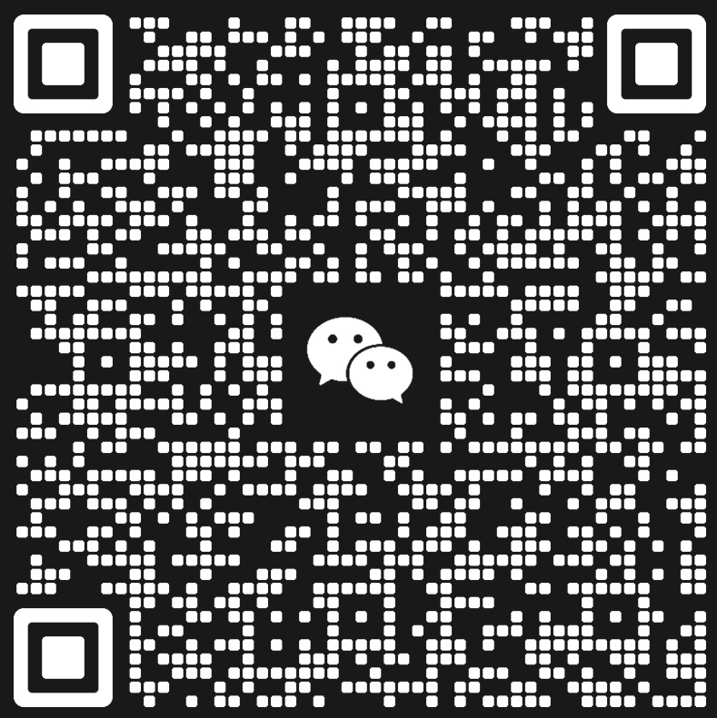

# 春节不摆烂 · TileLang 算力入门挑战

欢迎参加 **TileLang 算力入门挑战**！

本活动是沐曦股份联合 TileAI 技术社区推出的春节技术活动，旨在帮助 AI 开发者、学生及技术爱好者在春节期间入门 GPU 算子优化，掌握 TileLang 这一强大的深度学习编译器。

---

## 活动简介

春节，是技术宅一年中最容易摆烂、也最容易偷偷变强的时间。

当别人刷短视频、抢红包的时候，总有人在凌晨 pull 模型、跑推理、调参数、看报错。

2026 年春节期间，沐曦股份联合 TileAI 技术社区，推出一次真正能上手、真有算力、真能学东西的春节技术活动：

> 不卷 KPI，不讲 PPT，就给你算力 + 课程 + 实操场景。

---

## 活动时间

**2026 年春节假期**

- Day 0：活动预热 & 报名
- Day 1-2：新手快速上手（领算力 + 跑第一个任务）
- Day 3-9：进阶实操挑战（课程 + 任务解锁）
- Day 10：春节技术打卡收官 & 排行榜公布

每天 1-2 小时即可参与，不打扰过年。

---

## 参与对象

- AI / ML / Infra 工程师
- 在校学生（计算机 / 人工智能相关专业）
- 技术宅 / 开源爱好者
- 想趁春节低成本入门 AI Infra / 大模型的新人

**不要求基础很强，但要求：愿意动手。**

---

## 三大任务方向

本活动主要分为三个任务方向，完成任意方向即可获得算力奖励：

### 任务一：mcTileLang 源码安装

完成 mcTileLang 源码编译安装，理解 TileLang 核心架构。

**目标：**
- 成功编译安装 mcTileLang
- 运行示例代码验证安装
- 提交安装过程中遇到的问题与解决方案（如果有）

**详细教程：** [mcTileLang 源码编译教程](./spring_tilelang/docs/mctilelang-install.md)

---

### 任务二：TileLang Puzzle 练习

通过 TileLang Puzzle 练习，掌握 TileLang 编程基础。

**目标：**
- 完成基础 Puzzle 任务
- 理解 TileLang 的编程模型

**练习路径：** [tilelang-puzzles](https://github.com/tile-ai/tilelang-puzzles)


---

### 任务三：Puzzle 学习文档撰写

整理学习笔记，编写 TileLang 学习文档，分享技术心得。

**目标：**
- 整理 Puzzle 练习过程中的笔记
- 编写 TileLang 学习文档
- 分享技术心得与踩坑经历

**提交方式：** 将项目提交到 `spring_tilelang/submissions/YOUR_ID/` 目录

---

## 算力领取方式

### 基础算力包

报名成功即可领取春节专属基础算力包（100元福利）。

### 进阶算力包

完成指定任务可解锁：
- 进阶算力包（春节专属：200元福利）
- 高性能 GPU 限时体验

> 算力不是抽奖，是用行动换的。

---

## 任务等级

### 基础任务

| 等级 | 内容描述 |
|------|----------|
| Level 1 | 完成 mcTileLang 源码安装并提交验证截图 |
| Level 2 | 完成 5 个及以上 TileLang Puzzle 练习 |
| Level 3 | 提交 TileLang 学习文档 / 每个 Puzzle 一个文档或者学习总结 |


## 奖励与福利

### 基础福利（限前50名）

- 春节专属算力包
                             
### 进阶奖励（只要你敢，管够）

- 高性能 GPU 算力体验 + TileLang 进阶探索

### 彩蛋奖励（Top 5 活跃参与者）

- 技术周边（书籍、周边礼物等）
- 优秀技术分享推荐至社区首页

---

## 快速开始

### 1. Fork 本仓库

点击右上角 Fork 按钮，将本仓库 Fork 到你的账号下。

### 2. Clone 你的仓库

```bash
git clone https://gitlink.org.cn/YOUR_USERNAME/GPUKernelContest.git
cd GPUKernelContest/spring_tilelang
```

### 3. 创建你的任务目录

```bash
# 以你的 Gitlink ID 创建目录
mkdir -p spring_tilelang/submissions/YOUR_ID
cd spring_tilelang/submissions/YOUR_ID
```

### 4. 开始任务

根据上述三大任务方向，选择你感兴趣的任务开始：

- [任务一：mcTileLang 源码安装](./spring_tilelang/docs/mctilelang-install.md)
- [任务二：TileLang Puzzle 练习](./spring_tilelang/docs/tilelang-puzzle.md)
- [任务三：学习文档撰写](./spring_tilelang/docs/writing-guide.md)

---

## 提交规范

### 提交内容包含

- 任务完成代码 / 文档
- 运行截图或验证结果
- 使用说明文档（README.md）

### 提交方式

1. 在你的 Fork 仓库中完成修改
2. 提交 Pull Request 到本仓库
3. PR 标题格式：`[SpringTileLang] Gitlink ID - 任务名称`
4. PR 描述中说明完成的任务内容和得分项

### 提交示例

```
[SpringTileLang] alice - mcTileLang 源码安装 + 5个Puzzle

完成任务：
- [x] mcTileLang 源码安装（Level 1）
- [x] TileLang Puzzle 练习（Level 2）
  - copy
  - conv
```

---

## 参考资源

### mcTileLang 相关

- [mcTileLang 仓库](https://gitee.com/metax-maca/mcTileLang)
- [mcTileLang 文档](https://gitee.com/metax-maca/mcTileLang/tree/main/docs)
- [TileLang 官方仓库](https://github.com/tile-ai/tilelang)

### TileLang Puzzle

- [tilelang-puzzles 仓库](https://github.com/tile-ai/tilelang-puzzles)

### MACA 开源项目

- [mcTVM](https://github.com/MetaX-MACA/mcTVM)
- [FlashMLA](https://github.com/MetaX-MACA/FlashMLA)
- [mcEigen](https://github.com/MetaX-MACA/mcEigen)
- [mcPytorch](https://github.com/MetaX-MACA/mcPytorch)

---


## 联系与帮助

如需帮助或有疑问，请：

1. 在本仓库发起 Issue
2. 加入 TileLang 微信群

3. 联系活动主办方

---

## 活动总结

> **这是一次不讲虚话的春节技术活动，**
> **算力是真的，课程是能跑的，**
> **参与的人，是真的能学到东西的。**

祝你春节不摆烂，用算力换成长！
